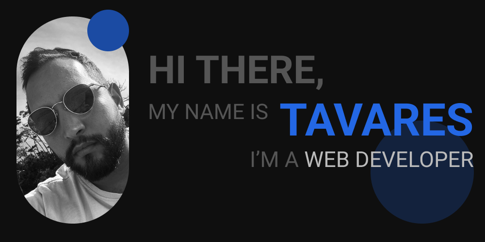
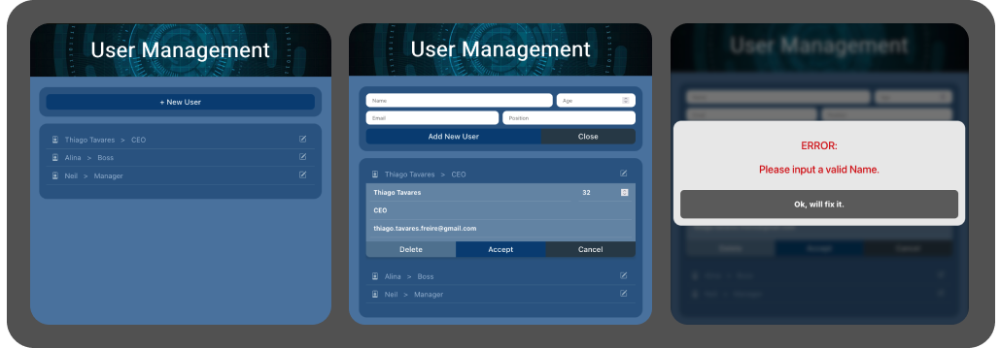
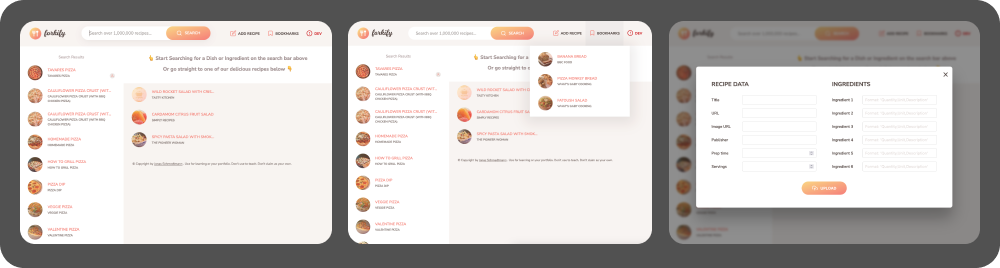
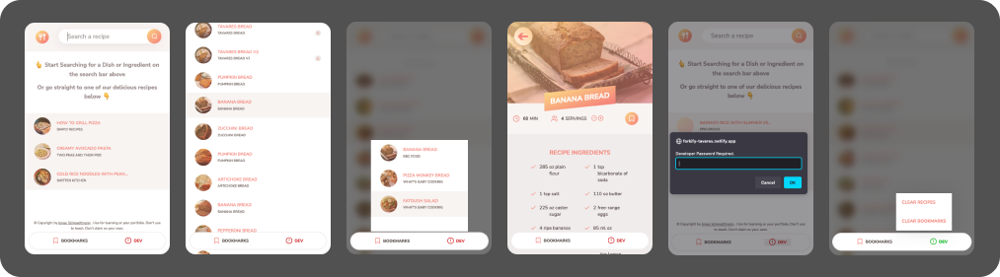
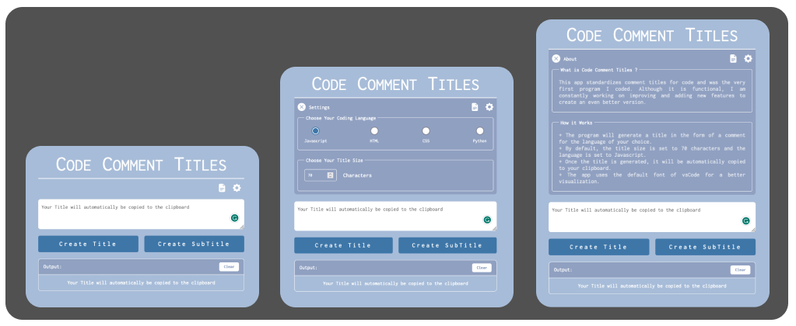

 
 
 

# A Little Bit About Me...

I'm a web developer on the lookout for that first amazing job in the industry!
I've put in the hard work, honed my coding skills, and now it's time to showcase what I'm made of. I've got a portfolio filled with my coolest projects, and my passion for web development drives everything I do.

The web development world excites me, and I'm ready to rock my dream job with my coding prowess!

#

#

 
 

# Links to my Portfolios and Social Media

&nbsp;&nbsp;&nbsp; [Web Dev Portfolio](https://webdev.thiagotavares.com/) &nbsp;&nbsp;&nbsp;
&nbsp;&nbsp;&nbsp; [Creative Portfolio](https://thiagotavares.com/) &nbsp;&nbsp;&nbsp;
&nbsp;&nbsp;&nbsp; [Linkedin](https://www.linkedin.com/in/ttavaresf/) &nbsp;&nbsp;&nbsp;
&nbsp;&nbsp;&nbsp; [Instagram](https://www.instagram.com/dateuspulo/) &nbsp;&nbsp;&nbsp;

#

#

 
 

# Skills Set

#### CODING :.

 &nbsp;&nbsp;&nbsp; Git &nbsp;&nbsp;&nbsp;
&nbsp;&nbsp;&nbsp; GitHub &nbsp;&nbsp;&nbsp;
&nbsp;&nbsp;&nbsp; VS Code &nbsp;&nbsp;&nbsp;

##

#### WEB DEVELOPMENT :.

&nbsp;&nbsp;&nbsp; Javascript &nbsp;&nbsp;&nbsp;
&nbsp;&nbsp;&nbsp; HTML &nbsp;&nbsp;&nbsp;
&nbsp;&nbsp;&nbsp; CSS &nbsp;&nbsp;&nbsp;
&nbsp;&nbsp;&nbsp; SASS &nbsp;&nbsp;&nbsp;
&nbsp;&nbsp;&nbsp; React &nbsp;&nbsp;&nbsp;

##

#### THINGS I HAVE SOME KNOWLEDGE :.

&nbsp;&nbsp;&nbsp; Wordpress &nbsp;&nbsp;&nbsp;
&nbsp;&nbsp;&nbsp; Shell Script &nbsp;&nbsp;&nbsp;
&nbsp;&nbsp;&nbsp; Figma &nbsp;&nbsp;&nbsp;

##

#### STUFF I USE TO WORK WITH BEFORE MY CODING JOYRNEY :.

&nbsp;&nbsp;&nbsp; Photoshop &nbsp;&nbsp;&nbsp;
&nbsp;&nbsp;&nbsp; Illustrator &nbsp;&nbsp;&nbsp;
&nbsp;&nbsp;&nbsp; Premiere Pro &nbsp;&nbsp;&nbsp;

##

#

 
 

# Some of My Projects

### User Management Feature - React Project

A small react project I challenged my self to fix the foundations of my react learnings. You can check the [ Deployed version of it Here](https://tavares-user-management-feature.netlify.app/). And the project [Code here](https://github.com/T-Tavares/user-management-feature).

#

### Forkify - Javascript Project ( Udemy )

Desktop Version of the final project of the Udemy course [The Complete Javascript Course 2023](https://www.udemy.com/course/the-complete-javascript-course/learn/lecture/22648975?start=345#overview) by [Jonas Schmedtmann](https://www.udemy.com/user/jonasschmedtmann/)

And here is the mobile tweaks I've done for the project. You can check the [ Deployed version of it Here](https://forkify-tavares.netlify.app/). And the project [Code here](https://github.com/T-Tavares/tavares-forkify-udemy-course).

#

### Code Comment Titles

Even though this project is simple and straightforward. It holds a special place for me since it was the first one I conceived and built entirely on my own.

Surprisingly, I continue to use it to keep my projects neatly organized and well-managed.
You can check the [ Deployed version of it Here](https://t-tavares.github.io/Code-Comment-Titles/). And the project [Code here](https://github.com/T-Tavares/Code-Comment-Titles).

 
 
 

# Random Things about me

I have a fine arts degree. And every now and then I still paint and sculpt stuff.( Nowadays only for fun.)

[Check my old sculpture portfolio](https://sculptures.thiagotavares.com/) or even my old [Instagram](https://www.instagram.com/ttavares_/) for painting and drawings.

